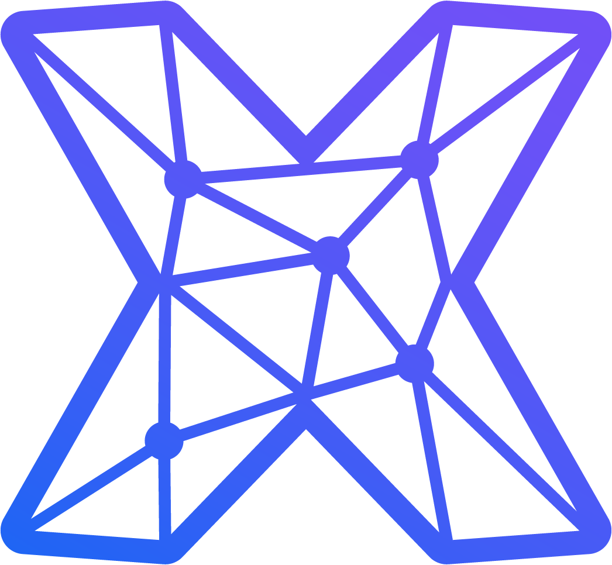

    
    <h1>CHANGELOG</h1>

  

| Version     | Date       | Type           | Description                                                                 |
|:-----------:|:----------:|:---------------|:----------------------------------------------------------------------------|
| **📦 7.0-1**  | 2025-08-12 | 🛠️ Bug Fixes   | Fix compatibility with Zabbix 7.0.12 and higher                              |
| **📦 7.0-0**  | 2024-06-01 | 🚀 Initial     | Initial release of the project                                               |

<!-- Structure template:---------------------------------------------------------------------------------------------------

| Version     | Date       | Type           | Description                                                                 |
|:-----------:|:----------:|:---------------|:----------------------------------------------------------------------------|
| **📦 XXX**  | 2024-08-22 | ✨ New Features | description                                                                 |
|             |            | 🔄 Updates     | description                                                                 |
|             |            | 🛠️ Bug Fixes   | description                                                                 |
|             |            | 🛡️ Security    | description                                                                 |
| **📦 1.0**  | 2024-08-22 | 🚀 Initial     | Initial release of the project                                               |

----------------------------------------------------------------------------------------------------------------------- -->