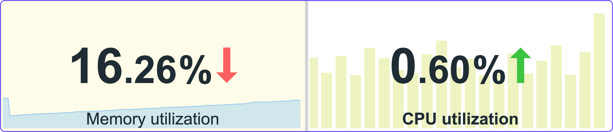
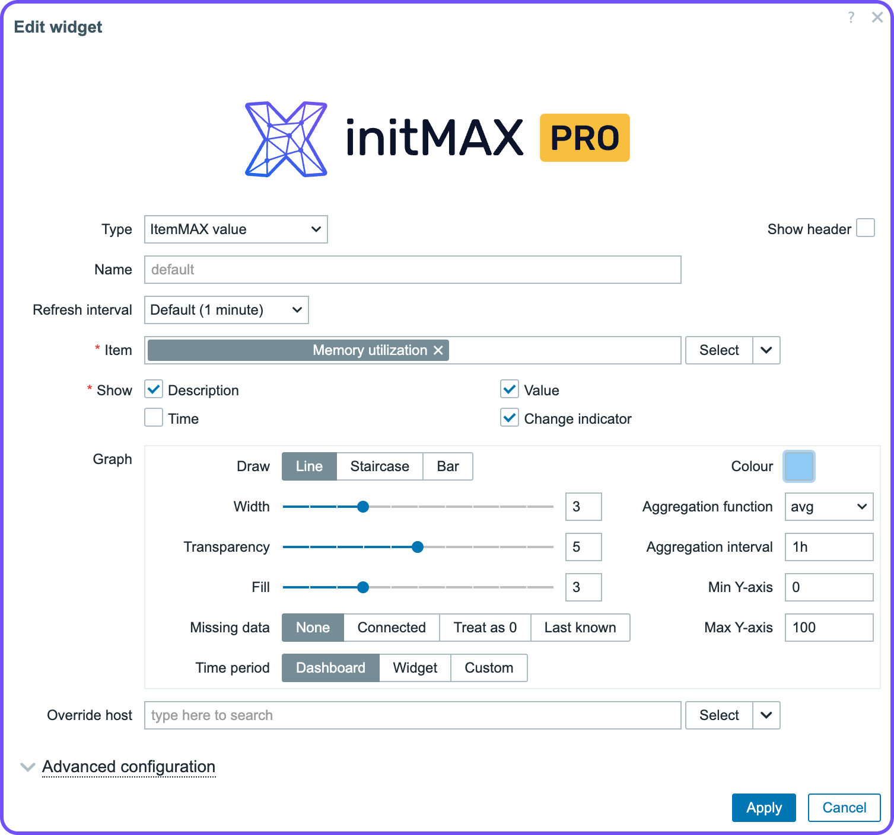

    
    <h3>
        
            Honesty, diligence and MAXimum knowledge of our products is our standard.
        
    </h3>
    <h3>
        &nbsp;&nbsp;&nbsp;
        &nbsp;&nbsp;&nbsp;
        &nbsp;&nbsp;&nbsp;
        &nbsp;&nbsp;&nbsp;
        &nbsp;&nbsp;&nbsp;
        
    </h3>

 

---
---

 
 

    <h1>
        itemMAX
    </h1>
    <h4><i>
        Extends the Item value widget with a background graph. Clearly and concisely displays current status information along with historical data visualization.
    </i></h4>
     
     <!-- !!! change version !!! -->
     <!-- !!! change version !!! -->
    <h3>
        <a href="#description">Description</a> •<!-- !!! change list !!! -->
        <a href="#key_features">Key features</a> •<!-- !!! change list !!! -->
        <a href="#editions">Editions</a> •
        <a href="#configuration_page">Configuration page</a> •
        <a href="#installation">Installation</a>
    </h3>
     
     <!-- !!! change version !!! -->

 
 

## Description
This advanced widget significantly enhances the functionality of the classic Item Value widget by integrating a visualization of historical data directly into the background. The current value is prominently displayed in the foreground, while a compact graph in the background provides valuable context and allows for tracking data evolution over time.

<!-- *********************************************************************************************************************************** -->
 

## Key features
The widget combines current value display with historical data graphing, enabling quick trend analysis. Users can choose between line, staircase, or bar graphs to best represent their data.

Aggregation functions are supported, allowing efficient processing of large datasets or varying time periods. The time range for historical data is customizable, providing flexibility in trend observation.

An override host feature allows users to specify which host’s data is displayed, facilitating monitoring across different systems or devices.

This compact tool is ideal for real-time monitoring with historical context, suitable for applications in IT infrastructure or environmental monitoring. It empowers users to make informed decisions based on both current and historical data trends.

<!-- *********************************************************************************************************************************** -->
 

## Editions

| Function                                            | FREE   | PRO        |
|-----------------------------------------------------|:------:|:----------:|
| All features of 'Item value' widget                 | ✅     | ✅          |
| Graph in the background visualizes historical data  | ✅     | ✅          |
| Customizable graph settings                         | ❌     | ✅          |
| ├  Line, Staircase, and Bar graph types             | ❌     | ✅          |
| ├  Adjustable graph width                           | ❌     | ✅          |
| ├  Graph transparency control                       | ❌     | ✅          |
| ├  Fill level adjustment                            | ❌     | ✅          |
| ├  Color selection for graph in the background      | ❌     | ✅          |
| ├  Aggregation function (e.g., average)             | ❌     | ✅          |
| ├  Custom aggregation intervals                     | ❌     | ✅          |
| ├  Handling of missing data                         | ❌     | ✅          |
| ├  Customizable time period for data display        | ❌     | ✅          |
| └  Min and Max Y-axis customization                 | ❌     | ✅          |

<h3>
    Get PRO version: <a href="https://www.initmax.com/product/itemmax/">Product page</a> <!-- !!! change version !!! -->
</h3>

<!-- *********************************************************************************************************************************** -->
 

## Configuration page

    

 

| Field                     | Description                                                                                      |   |
|---------------------------|--------------------------------------------------------------------------------------------------|---|
| **Draw**                  | Select the type of graph: Line, Staircase, or Bar.                                               | * |
| **Width**                 | Adjust the thickness of the graph lines.                                                         | * |
| **Transparency**          | Set the transparency level of the graph to better integrate with the widget's background.        | * |
| **Fill**                  | Adjust the fill level under the graph line for better visual distinction.                        | * |
| **Color**                 | Customize the color of the graph to match your dashboard theme.                                  | * |
| **Aggregation Function**  | Use different functions (e.g., average) to aggregate data points.                                | * |
| **Aggregation Interval**  | Define custom intervals for data aggregation.                                                    | * |
| **Missing Data**          | Choose how to handle missing data points (e.g., none, connected, treat as 0, last known).        | * |
| **Time Period**           | Set specific time periods for data display in the graph (e.g., Dashboard, Widget, Custom).       | * |
| **Min Y-axis**            | Define custom minimum values for the Y-axis.                                                     | * |
| **Max Y-axis**            | Define custom maximum values for the Y-axis.                                                     | * |
| **Override host**         | Allows displaying data from a different host than originally configured                          | * |

> `*` Settings available only in PRO version

  

    <a href="https://www.initmax.com/wiki/itemmax/">
         
        <b>Documentation</b> 
        
    </a>

 
 

---
---

 

    <a href="https://www.initmax.com/">
         initMAX.com
    </a>&nbsp;&nbsp;&nbsp;
    <a href="tel:+420800244442">
         +420800244442
    </a>&nbsp;&nbsp;&nbsp;
    <a href="mailto:info@initmax.com">
         info@initmax.com
    </a>
       
    &nbsp;
    &nbsp;
    &nbsp;
    &nbsp;
    &nbsp;
       
    &nbsp;&nbsp;&nbsp;
    
       
    

